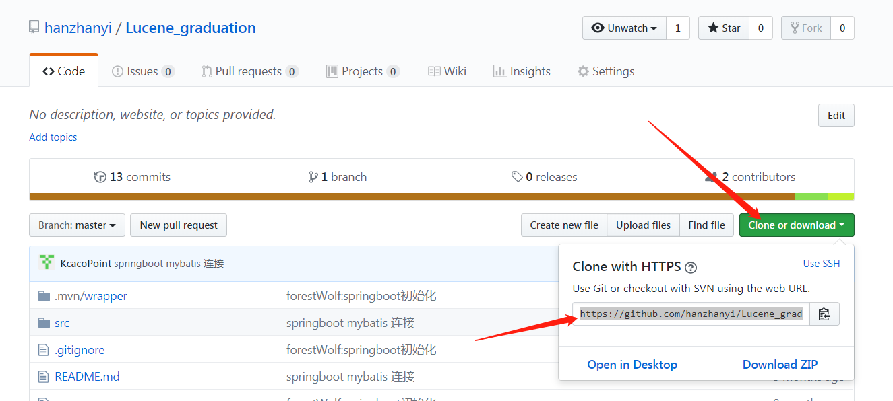

贾老师，原有安卓包无法访问，原因在于阿里云学生服务器到期了，无法访问。

##  代码地址：
安卓代码：https://github.com/hanzhanyi/Android_graduation

后端代码：https://github.com/hanzhanyi/Lucene_graduation

##  需要下载的开发环境：

### 后端需要：

IntelliJ IDEA  版本不限  （类似于Eclipse）

JDK 1.8以上

git 最新版即可  （用于网上代码）

maven 3.0.0以上   （用于下载jar包依赖）

redis 最新版即可 （服务器端缓存）

Mysql 数据库 版本不限

---

### 安卓端需要：

android studio 最新版即可  （用来打开安卓代码）

安卓端参考 《android 第一行代码》 这本书的最后一部分，天气APP的制作过程即可

---

### 后端操作步骤：

首先配置jdk环境变量 
https://www.cnblogs.com/boringwind/p/8001300.html

IDEA下载： 
https://www.jetbrains.com/idea/

git下载及配置： 
https://jingyan.baidu.com/article/9f7e7ec0b17cac6f2815548d.html

git在idea中的配置： 
https://www.cnblogs.com/hkgov/p/7694101.html

maven下载及配置： 
https://jingyan.baidu.com/article/3052f5a1e8f86397f21f8671.html

Redis安装及配置 
http://www.runoob.com/redis/redis-install.html

### 安卓端操作步骤：
android studio下载 ： 
https://developer.android.com/studio/

---

## 代码查看步骤：

- 通过idea下载后端代码：

- 打开代码网址，找到代码地址：
  

- 通过idea下载代码
教程地址： 
https://blog.csdn.net/asdfghjklor/article/details/79009544

- 配置项目所需的jdk版本： 
https://blog.csdn.net/Elenal/article/details/53364509

- 找到pom.xml文件 点击右键 找到AS a maven project ，等待导入依赖的jar包完成即可

- 运行后端项目，通过LuceneGraduationApplication此文件，运行main方法即可。

- 具体初始化过程，可以参考论文中的接口设计，需要先爬取数据，在建立索引，等待索引建立完毕才能进行接口调用访问，用到的相应技术也在论文中。

- 安卓端需要更改配置文件中的服务器IP地址，重新打apk包才可运行，本地模拟器运行可配置127.0.0.1。

---

### 以上为后端查看代码所需工具集合以及编译所需，安卓端配置运行安装详细，可完全参照《android 第一行代码》（高强有这本书），安卓端时间太长，有遗忘了。

### 注意事项

- 爬取代码考虑服务端性能，只使用单线程进行爬取，大概1G 单核 机器需要20min左右，如果需重新建立索引，先删除原有索引再重新建立。

- 后端配置文件都在application.properties中，如有修改可自行更改。
